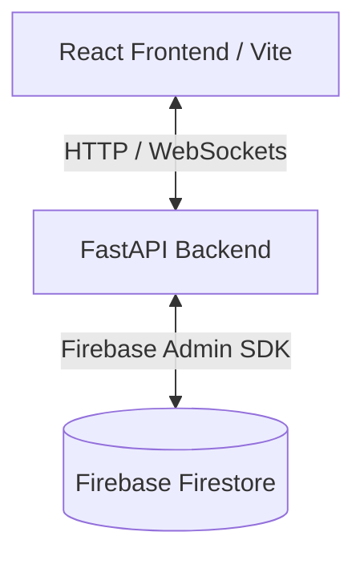

# Nexus Treasure Hunt - Technical Documentation 

This repository contains the source code for the **Nexus Treasure Hunt** application, a real-time QR code-based treasure hunt game. The project is split into a Python-based FastAPI backend and a React/TypeScript/Vite-based frontend.

---

## Architecture Overview



- **Backend**: FastAPI (Python) handles the API routing, WebSocket manager (for real-time updates), and direct communication with Firebase Firestore.
- **Frontend**: React + TypeScript + Vite + Tailwind CSS.
- **Database**: Firebase Firestore.

---

## Repository Structure

```
├── backend/
│   ├── api/            # API endpoints & server initialization
│   ├── core/           # Config, Firebase setup, WebSockets
│   ├── routers/        # FastAPI routes (admin, player)
│   ├── schemas/        # Pydantic data schemas
│   ├── .env.example    # Backend environment template
│   └── seed.py         # Firestore database seed script
├── frontend/
│   ├── src/            # React codebase (components, pages, routing)
│   ├── public/         # Static assets
│   ├── .env.example    # Frontend environment template
│   └── vite.config.ts  # Vite configuration
└── package.json        # Workspace dev scripts (using concurrently)
```

---

## Development Setup

### 1. Prerequisites
- **Python 3.10+**
- **Node.js 18+**
- **Firebase Project**: A Firestore database with a generated Private Key (service account JSON file).

---

### 2. Backend Setup

1. **Navigate to backend and create a virtual environment**:
   ```bash
   cd backend
   python -m venv venv
   # On Windows:
   .\venv\Scripts\activate
   # On macOS/Linux:
   source venv/bin/activate
   ```

2. **Install Dependencies**:
   ```bash
   pip install -r requirements.txt
   ```

3. **Configure Environment Variables**:
   Create a `.env` file in the `backend/` directory (based on `.env.example`):
   ```ini
   ADMIN_SECRET_KEY=your_development_secret_key
   ADMIN_EMAIL=admin@nexus.com
   ADMIN_PASSWORD=your_secure_password
   FIREBASE_CREDENTIALS_PATH=path/to/your/firebase-adminsdk.json
   ```

4. **Initialize/Seed Firestore**:
   Place your Firebase admin credentials JSON file in the `backend/` directory and update the `FIREBASE_CREDENTIALS_PATH` in `.env`. Run the seed script:
   ```bash
   python seed.py
   ```

5. **Start Backend Server**:
   ```bash
   uvicorn api.index:app --reload
   ```
   The backend will be available at `http://127.0.0.1:8000`. Swagger API documentation is accessible at `http://127.0.0.1:8000/docs`.

---

### 3. Frontend Setup

1. **Navigate to frontend**:
   ```bash
   cd ../frontend
   ```

2. **Install Dependencies**:
   ```bash
   npm install
   ```

3. **Configure Environment Variables**:
   Create a `.env` file in the `frontend/` directory (based on `.env.example`):
   ```ini
   VITE_API_BASE_URL=http://127.0.0.1:8000
   VITE_APP_TITLE="Nexus Treasure Hunt"
   ```

4. **Start Development Server**:
   ```bash
   npm run dev -- --host
   ```
   The frontend will be available at `http://localhost:5173`.

---

### 4. Running the Entire Workspace Collectively

You can run both the frontend and backend concurrently from the root directory of the project:

1. **Install Root Node Modules**:
   ```bash
   npm install
   ```

2. **Run Joint Dev Command**:
   ```bash
   npm start
   ```
   This command starts the Vite dev server and Uvicorn API concurrently.

---

## Key Configuration & Customization

### CORS Settings
The CORS policy in `backend/api/index.py` is configured with `allow_origins=["*"]` and `allow_credentials=False` to allow cross-origin API and WebSocket requests across various client deployment scenarios. This will be changed once launched to production.

### Real-Time Communications
Real-time dashboard updates are facilitated via WebSockets at the `/ws/game` endpoint, managed by the connection manager located in `backend/core/websocket.py`.
